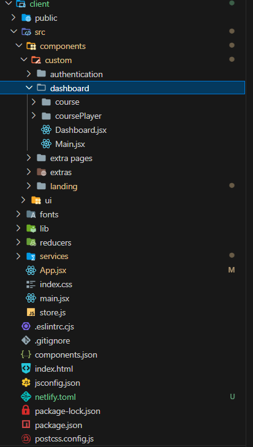
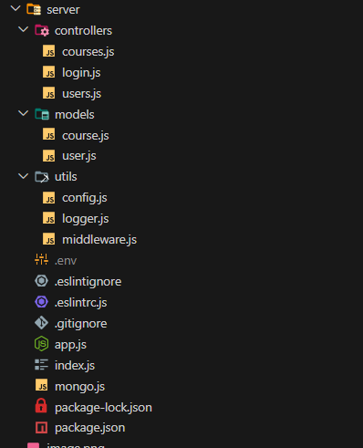

# HunarBazar
[](https://app.netlify.com/sites/hunarbazar/deploys)

Welcome to HunarBazar! This project is a platform where users can browse, enroll, and participate in various courses. The website features a smooth onboarding process, user authentication, and a dashboard for managing enrolled courses.

## Features

- **Landing Page**: The entry point for the website where users can learn about HunarBazar and its offerings.
- **Onboarding System**: Guides new users through the process of getting started with HunarBazar.
- **Authentication**:
  - **Login**: Users can log in at `/api/login` (POST request).
  - **Register**: New users can sign up at `/api/useres` (POST request).
- **Dashboard**:
  - Displays the courses the user is currently enrolled in.
  - Shows recommended courses and upcoming courses.
- **Course Enrollment**:
  - Clicking on a recommended course takes the user to an enrollment page.
  - Users can follow the enrollment steps and provide additional details to join a course.
- **State Management**: Redux is used for managing state across the application.
- **UI Components**: Shadcn is used for building the user interface.
- **Deployment**:
  - Backend is deployed on Render.
  - Frontend is deployed on Netlify.

## Getting Started

To get started with the project locally, follow these steps:

1. **Clone the repository**:

   ```sh
   git clone https://github.com/yourusername/hunarbazar.git
   cd hunarbazar
   ```

2. **Install dependencies**

   ```sh
   cd client
     npm install
     cd ../server
   npm install
   ```

3. **Run client**

   ```sh
   cd client
   vite dev
   ```

4. **Run server**

   ```sh
   cd server
   node index.js
   ```

- The backend is deployed on Render and can be accessed via the provided API endpoints.
- Make sure to set up your environment variables for API URLs.

## API Endpoints

- Login: https://hunarbazar.onrender.com/api/login (POST)
- Register: https://hunarbazar.onrender.com/api/users (POST)
- Register: https://hunarbazar.onrender.com/api/users (GET)
- Users: https://hunarbazar.onrender.com/api/courses (GET)
- Courses: https://hunarbazar.onrender.com/api/courses (POST)


## Project Structure
### Client


### Server


## Ending thoughts
This was just made for practice and I wanted to learn new concepts like redux client-side state management and advanced axios actions. I also learnt about creating hooks to minimize redundant code. The code is as scaleable as I could make it. This project has around 5-10 hours of work put into it on and off which result in this. The main thing was that I learnt something and thats what matters

- **Hours:** 5-10 hours
- **Lines of Code:** 2000+ lines
- **Packages:** 9 + 6 = 15 packages
-  **Main Languages:** Javascript and JSX


Feel free to explore and expand upon this project to suit your needs. Thank you for checking out HunarBazar!
